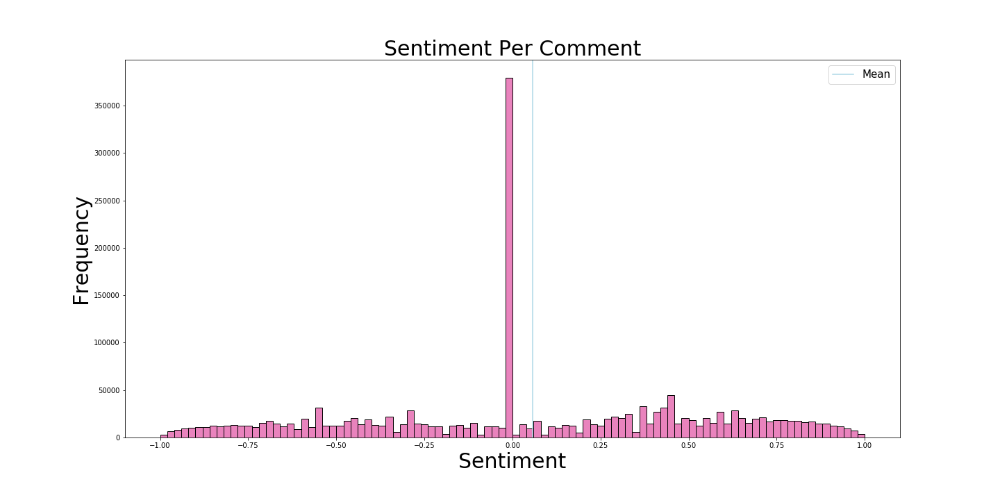
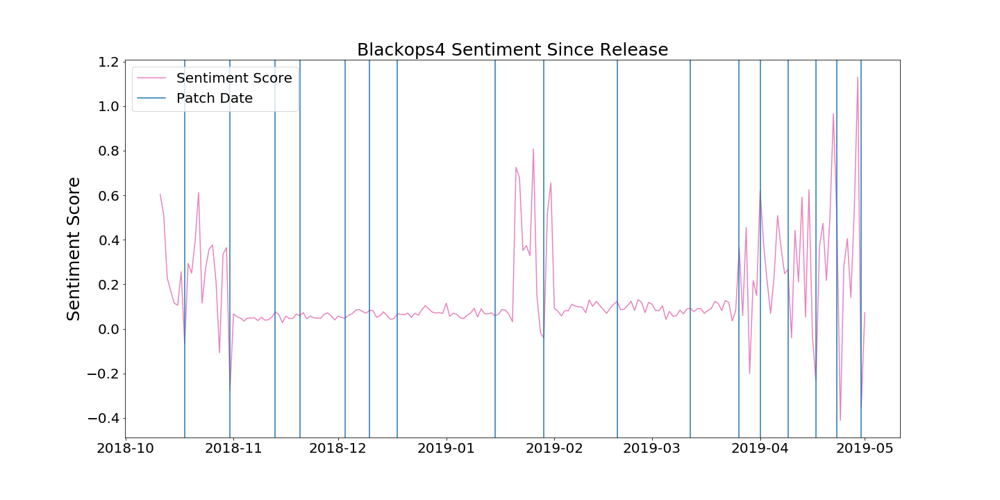
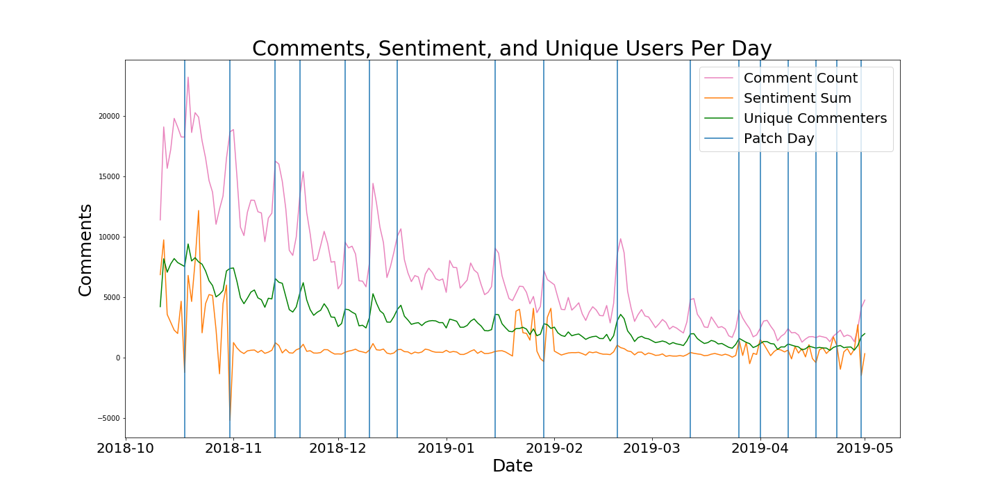
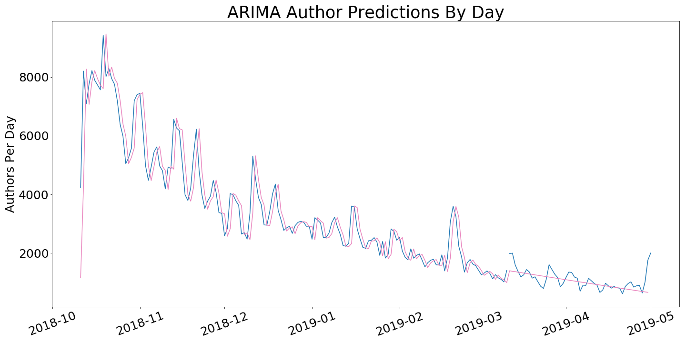
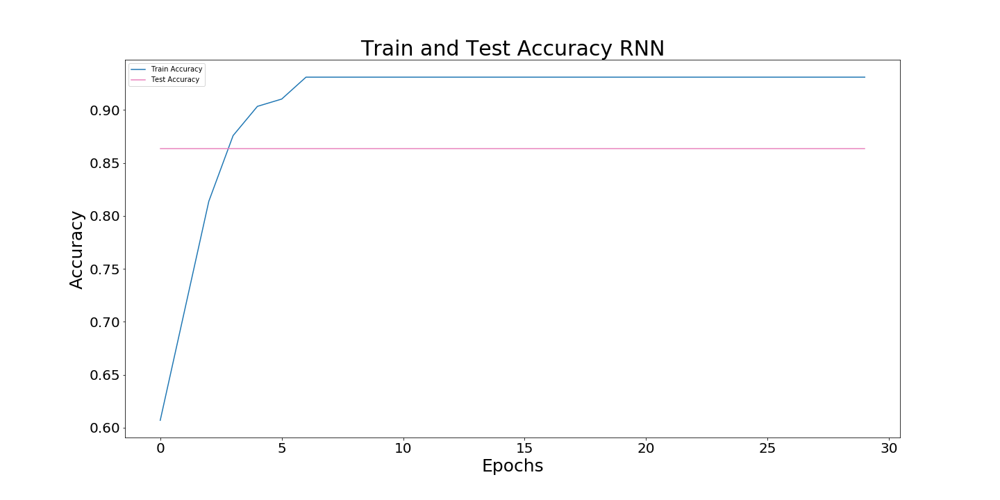
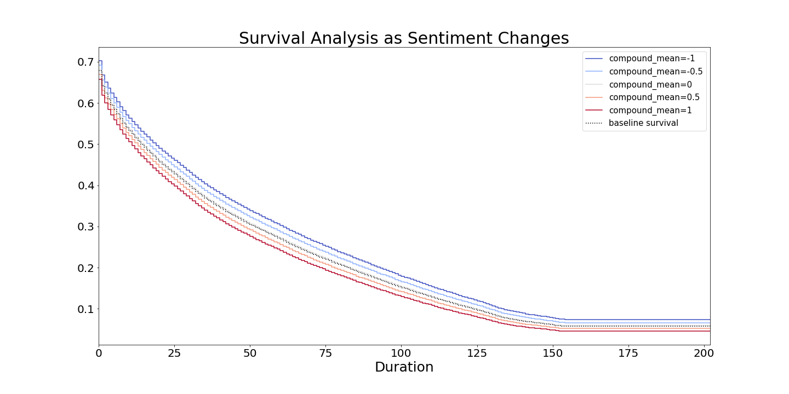

# Technical Report: Predicting Patches for Call of Duty: Black Ops 4 using NLP, Time Series, and Survival Analysis

## Problem Statement:

Call of Duty: Black Ops 4 was released on October 12th, 2018, to much anticipation, as it was the first time Call of Duty took a step in the direction of a Battle Royale game mode. Using data gathered from reddit, the front page of the internet, I will pull reddit comments from when the game came out until present day. Using this data, plus the data from regular patches and updates, I will provide insight into when new patches and updates should be released based on user feedback of the game on any given day, and whether Activision should use that feedback to guide future patches in order to maximize user retention and minimize churn. Given that online discussions can be about anything, I will specifically try to pinpoint topics revolving around new content and fixes that need to be made. I will be using a combination of sentiment analysis, time series analysis, and survival analysis to create my predictive models. 

I plan to measure my success or failure by comparing my model's predictions to past patches and updates. In the future, I plan to pull more data as time passes and compare my models performance on unseen data.

## Data Collection:

The Black Ops 4 subreddit is home to almost 300,000 subscribers, of whom up to 10,000 comment in any given day. I queried the Pushshift API to collect comments going back to the day before the game came out, which added up to be around 2.2 million comments.

After running my initial EDA on the dataset as a whole, I condensed and aggregated my data into a dataframe that presented the data on a day by day basis, which ended up being 203 rows by 38 columns. 

In addition to the programatic collection of reddit data, I had search google for the date of every patch update and add that to my dataset manually. 

## Exploratory Data Analysis and NLP: 

My EDA process happened somewhat out of order. Before cleaning my data, I ran VADER sentiment analysis on each comment and saved the 'compound' or overall sentiment score as a new column. I had to run VADER before cleaning the data because it is a sentiment analyzer designed for social media, and as such, it reads capitalization, punctuation, and emojis. VADER in 4 ways, positive, negative, neutral, and a compound score. The compound score ranges from -1 to +1. Below is the distribution of sentiment over the entire corpus. 

After implementing VADER, I cleaned my data by using regex, deleting nonsense comments, and putting a character and bottom word limit on the data. This decreased the size of my dataset by about 20%, meaning that there were a lot of nonsense comments, which makes sense considering I pulled data from a forum. 
    
In an effort to make the sentiment as polar as possible, I removed all comments that had a sentiment score of zero and all comments that had a reddit score of zero. Neutrality was negatively affecting my dataset and I wanted to look at strictly positive or negative sentiment. In this vein, I created an interaction column that multiplied the reddit score by the sentiment score to additionally boost or negatively impact comments with sentiment based on how popular they were. We can see below that the sentiment surrounding patches fluctuates heavily and doesn't really follow a distinct pattern. 
    

    
After examining the sentiment on its own, I decided to look at it in relation to patches, unique authors, and number of comments per day. We can see that number of comments and number of authors spikes at every patch update, while also declining over time. The sentiment doesn't follow the same trend. The sentiment has a few early spikes and dips, then levels out until January, when it spikes and dips again, and then levels out until April, when it does the same. 
    

    
I wanted to see how specific words affected the three measurements above, so I added a filter based on words I know to be 'trigger' words, or words that have very clear indications of sentiment regarding the game and what the users want when they use the words. I called this my op_list, meaning my Overpowered List, basically a list of words that people complain about most, which I know from having played the game extensively. We can see the sentiment of comments including each word below, as well as the frequency of each word in between each patch. 
    
I count vectorized these words manually and added them to their own dataset. 
    

    
Two things to note:
1. The frequency of the words decreases over time with respect to patch releases, except for a spike in January, which is due to the holiday vacation from releasing patches. More recently, the frequency decreased because patches started being released twice as often.
2. In the beginning, these words were mentioned between 60k and 120k times over two week periods, meaning people were unhappy with Activision for not making seemingly necessary fixes. After a couple months, the frequency dipped quite significantly, suggesting that perhaps the fixes had been made and the few lurker complainers remained. 

Lastly, I ran a count vectorizer to look at bi grams used in the dataset. Of the top 15, the ones that had the most negative sentiment were 'dont know', 'dont think', 'game just', 'dont want', and 'firing range'. The rest of the bi grams in the top 15 were either positive or neutral. 

## Modeling:

### ARIMA: 

As an additional form of EDA, I ran three ARIMA models to examine trends in the following three features:

1. Comment Count 
2. Unique Authors 
3. Sentiment

I wanted to explore the predictive power of each of these features on their own, as they are each autocorrelated. 
I found that when predicting sentiment, there too much noise and the data wasn't stationary, and as a result, my model testing predictions had an RMSE of .03(on a scale of -1 to +1), which performed worse than it would have had it predicted the mean. 

When predicting comment count, or participation, my testing predictions had an RMSE of 1612 comments per day, which was 3000 comments better than the RMSE had my model predicted the mean. The comment counts were stationary. 

Lastly, when predicting unique authors per day, my ARIMA model predicted really well, with an RMSE of 340 users. Had it just predicted the mean, its RMSE would have been around 1900 users. I suspect that because the trends in unique users were pretty constant, the model was able to grab onto the signal and predict something worth while. The data was stationary, with a t-test of -3.8 and a p value of .002. I dugg deeper into user churn in a later notebook. This was a good precursor to actually running Survival Analysis on the users. 

    
### Recurrent Neural Networks: 

On to the meat and potatoes! I decided to run a few Recurrent Neural Networks as my primary models for predicting patch days based on sentiment, reddit meta data, and specific word usage, some of which I picked myself based on domain expertise, and some of which I picked by using a count vectorizer. I ran three models with different features to see whether or not certain features had more predictive power than others, and I used RNN because it is the primary time series based neural network. I assigned my target class (patch days) to 1, and used 0 for any other day. There have been 18 patches released since Black Ops 4 was released, which leads to a class distribution of 91% zero class and 9% target class, which is pretty unbalanced. Given that this is a small dataset after condensing it down by day, I knew I had my work cut out for me. 

For each model, I messed around with tuning, but settled on 2 GRU layers, 2 Dense layers, and 1 Dropout layer, utilizing relu activations in my hidden layers and sigmoid as my output. I was aiming to optimize accuracy, meaning all of my positive predictions divided by all of my predictions. 

Because my target classes weren't distributed evenly throughout the dataset, I measured my accuracy by comparing my training accuracy to the distribution of my training set, and the testing accuracy to the accuracy of my testing set. In all three models, regardless of the different hyperparameters I tuned(length, batchsize, nodes, and output functions) and the features I selected, including a model that used Principal Component Analysis to find the most important components in my count vectorized dataset, my model was unable to predict patch days. My accuracy score was consistently hitting 93% on my training data, and 84-85% on my testing data, which turns out to be the baseline accuracy. This means that my model could predict 0 for every row and score this accurately. Below we can see the accuracies of the training and testing sets. 

Looking at the predictive probabilities, we can see that the probability of the target class never reaches 50%, so the model never predicts patch days. I tried manually adjusting the threshold, but in some cases the predictive probabilities were all so similar to each other that I would have had to adjust the threshold down to the 10,000th of a decimal, which was unwieldy. 

RNN was my ace in the hole, my nest egg, my saving grace. Discovering that it wasn't able to predict as well as I had hoped meant I had to settle for the opposite result of what I was aiming for. My model couldn't predict patch days, so Activision shouldn't use it to guage user feedback and implement changes the community(or select members of it) push for online. If my model can't predict patch days based on sentiment, specific word usage, and meta data in the form of user feedback, then there isn't enough proof to show that it would positively impact user retention. 

### Survival Analysis looking at User Churn:

Churn is when a customer, player, user, etc. decides to discontinue his or her relationship with the company, game, forum, etc. 

The last part of my project is an inspection of user churn from reddit specifically, and how that can have an effect on churn from the game. I didn't have data on user activity from the game, but I was hoping that by looking at what causes churn from the subreddit, I would be able to gain some insight into the user experience of playing the game. 

To begin, I created a duration column that basically gave the number of days between the user's most recent comment and their first comment. I then created a churn column that I set a condition on. If a user hadn't commented in the last 45 days, or didn't have a duration of more than 5 days, I considered that to be a churned user, and assigned them a 1, and the users that hadn't churned a 0. Using XGBoost Classifier, which is a sequential tree building model that corrects errors from the previous tree, I was able to produce an accuracy score of 95%, which was 5% better than the baseline of 90%(the distribution of churners in the whole dataset). 

Next, I used the lifelines COXPHfitter import(a python survival analysis module) to look at predicting how long users will stay engaged, and see what exactly affects their engagement. To do this, I examined their hazard coefficients and compared them to each users baseline hazard. Hazard is essentially, the rate at which something dies, a user stops using, etc. The hazard function estimates the likelihood of survival to a certain point in time based on its survival at the previous point in time. Below is a sample of the likelihood that each user will stay engaged for a certain amount of time. The columns are users, and the rows are 'days engaged'.

Lastly, I examined what exactly had the most effect on churn, using the Kaplan Meier Estimator, which is another model from the lifelines module that can be used to show time until 'death'. I looked specifically at how a users overall sentiment affected their churn rate. I found that the users with positive sentiment churned at a higher rate than those with negative sentiment, suggesting that the users who enjoy the game most don't enjoy participating on reddit with people who complain and are consistently negative about the game. This was the final conclusion in my project that made it clear that the people who like the game continue playing, regardless of the patches, until their natural churn. The complaints and gripes on reddit don't mean much for the gamers that actually enjoy the game, so there would be no reason for Activision to actively monitor user feedback on reddit to guide patch designs, because the majority of users on reddit that actually enjoy the game churn from reddit pretty quickly. 

## Conclusion and Next Steps

Given all of the data analyzed throughout these notebooks, I think in conclusion, **I will state that I don't think video game companies, specifically Activision, should pay close attention to user feedback on other forums as guidance to what release in new patches.** While there are specific words that elicit negative sentiment around the game, for the most part, people seem pleased with the game, and the ones that aren't pleased are few and far between that have powerful and frequent voices in the community. There isn't much predictive power coming from reddit meta data or nlp data in terms of patch updates, so why pay attention to it? The users that enjoy the game typically churn from reddit, which suggests that they continue playing the game without being a part of the online community. 

As next steps, I would look at gathering data over a longer time period. Obviously for that, I would have to wait until the game has been out longer. Additonally, I would scrape other websites to get a more diverse sample of users. Not everyone who comments or posts videos on youtube also comment on reddit, and vice versa. I think looking at streamers and how they comment on the game and the language they use could influence more people than what a single commenter on reddit says. In addition, I would look at the most common words in between each patch and see how those relate to what was released during each patch to see if there is overlap. Another step I would like to take, but may not be able to, is to get all of the updates, including just the mostly-daily fixes and see how those influence sentiment. The patch data isn't super accessible, and the frequent update data is even more inaccessable.